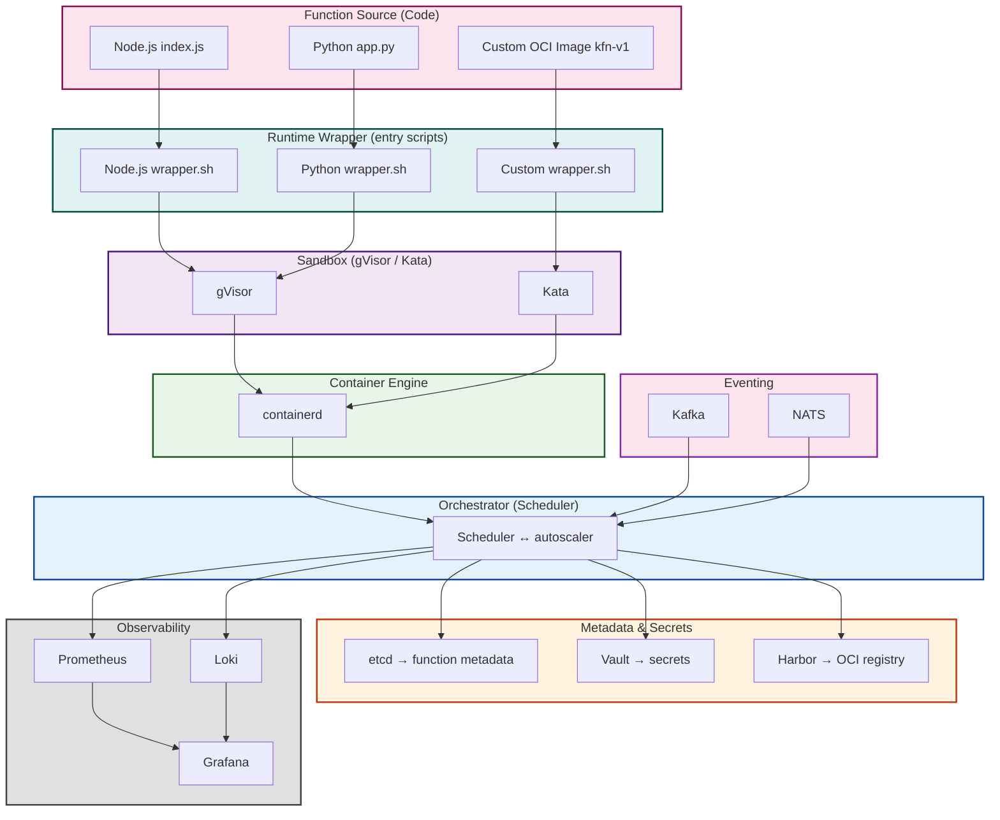
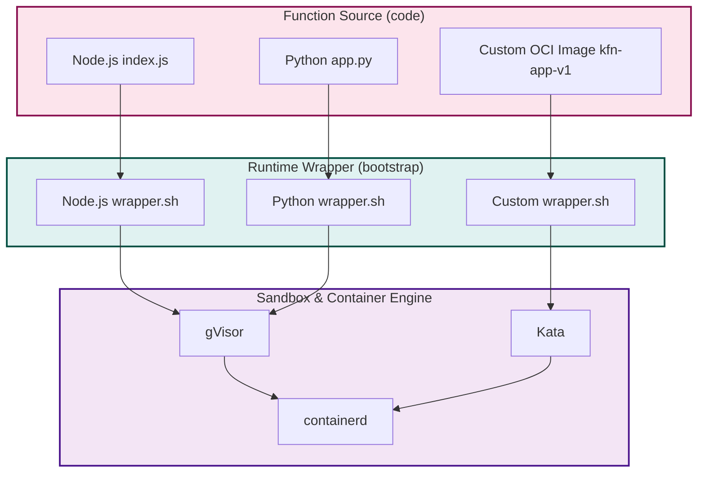

## 1. Refocused Vision

| Element | Goal |
|---------|------|
| **Official FaaS language** | **Go** (platform core) |
| **Primary function language** | **JavaScript (Node 14‑18)** + **Python (3.10‑3.11)** |
| **Polyglot support** | “Add 3rd‑party interpreter” users can bring‑your‑own Docker image, but platform will ship ready‑to‑run base images for Node and Python. |
| **Execution model** | *Container‑per‑invocation* (on‑prem, sandboxed by gVisor/Kata). |
| **Deployment** | CLI `faasctl` allows “deploy my‑function –lang node|python”. |
| **Observability** | Same as before: Prometheus, Loki/Grafana, logs in JSON. |
| **Security** | Strong isolation via gVisor, image signing (cosign), RBAC per tenant. |

---

## 2. Architecture Diagram



**Key changes**

| Change                                                                                                            | Reason                                |
| ----------------------------------------------------------------------------------------------------------------- | ------------------------------------- |
| **Function registry schema** now holds `language`, `runtimeImage`, `runtimeVersion`.                              | Scheduler can pick the right image.   |
| **Runtime image** is *minimal* (`node:alpine`, `python:slim`) plus a **runtime wrapper** that launches user code. | No heavy interpreter in container.    |
| **CI pipeline** now automatically builds the proper runtime image based on the function’s declared language.      | Easy for users to push zip or source. |

---

## 3. Core Technical Choices

| Layer | Go packages / CNCF components | Why |
|-------|-----------------------------|-----|
| **Registry** | `go.etcd.io/etcd/client/v3`, `github.com/dgrijalva/jwt-go` | Strong consistency, lightweight. |
| **Runtime wrapper** | `github.com/containerd/containerd`, `github.com/gvisor/gvisor` | Minimal OCI runtime + sandbox. |
| **Image Build** | `github.com/containers/buildah` (or `oci/oapi`), `github.com/golang/mock` (tests) | Build images without full Docker. |
| **Event Bus** | `github.com/segmentio/kafka-go` or `github.com/nats-io/nats.go` | Proven messaging layer. |
| **Observability** | `github.com/prometheus/client_golang`, `github.com/grafana/grafana` | Existing stack. |
| **CLI** | `github.com/spf13/cobra`, `github.com/spf13/viper` | Comfortable dev experience. |

---

## 4. Function Packaging & Deployment Flow

### 4.1 Function Image Specifications

| Language | Base image | Entrypoint | Packaging |
|----------|------------|------------|-----------|
| **Node.js** | `node:16-alpine` | `/entrypoint.sh` -> `/usr/local/bin/faa_layer_node` | `index.js`, optional `package.json`, `node_modules` ( optional – `npm ci` done by runtime wrapper ) |
| **Python** | `python:3.11-slim` | `/entrypoint.sh` -> `/usr/local/bin/faa_layer_py` | `app.py` (must expose async `handler(event, context)`) and `requirements.txt` |

The **runtime wrapper** (`_handler shim`) does:

1. **Validate** that the entrypoint exists.  
2. **Install** dependencies (`npm ci` / `pip install -r requirements.txt`) *once* – we write these steps to a *layer* that is cached per image to avoid re‑install on every run.  
3. **Parse** incoming HTTP/JSON event – expose to the user function.  
4. **Return** the result as HTTP, assuming the function follows the `aws lambda` payload shape:
   ```json
   { "statusCode": 200, "body": "…", "headers": {...} }
   ```

### 4.2  Deployment Steps

1. Developer writes code and `faasctl deploy myfn --lang node --runtime 18`.  
2. CLI validates language+version against platform whitelist.  
3. CLI uploads source (zip) to Harbor (or local registry).  
4. Scheduler fetches the image and runs it in a gVisor container on node X.  
5. Scheduler updates the in‑memory cache so subsequent invocations hit the warm container.  

> **Tip:** for event‑driven functions the deployment includes a **trigger** definition (`{"type":"kafka","topic":"orders"}`).

---

## 5. Platform Stack (High‑Level)



All containers (runtime, scheduler, API gateway) are plain OCI images. The Node/Python images are *builder images* created once per major version.

---

## 6. Detailed Development Roadmap (12 Weeks)

| Sprint | Focus | Key Deliverable | Gantt‑like Example |
|--------|-------|-----------------|---------------------|
| **0**  | Kick‑off + Final specs | Architecture doc, language support matrix | 2 weeks |
| **1**  | Registry & CLI | Etcd CRUD, `faasctl deploy` CLI (no runtime yet) | 2 weeks |
| **2**  | Scheduler core (Go) | Launches generic containers, warm pool support | 2 weeks |
| **3**  | Runtime wrapper templates | Node, Python wrappers + mock tests | 2 weeks |
| **4**  | Image build system | buildah helper, Harbor registry integration | 2 weeks |
| **5**  | HTTP & event triggers | API gateway + Kafka consumer + request routing | 2 weeks |
| **6**  | Security & RBAC | mTLS, JWT scopes, image signing | 2 weeks |
| **7**  | Observability | Prometheus metrics, Grafana dashboards | 2 weeks |
| **8**  | Autoscaling + resource limits | Scheduler policy, cgroup limits | 2 weeks |
| **9**  | Polyglot experiments | Add Ruby 3.0 runtime, test polyglot demo | 2 weeks |
| **10** | Benchmark & CI | Latency (<50 ms), CI pipeline, unit + integration | 2 weeks |
| **11** | Documentation & demo | `faasctl` help, design docs, live demo | 2 weeks |
| **12** | Stabilization | Bug‑fixes, final security audit | 2 weeks |

> Each sprint has a *definition of done*: code reviewed, tests passing, docs updated.

---

## 7. Runtime Image Build Workflow

```
$ faasctl deploy hello --lang node --runtime 18
   1️⃣ Clone source -> /tmp/hello
   2️⃣ Create Dockerfile (dynamic):
        FROM node:18-alpine
        COPY ./ .
        RUN npm ci --production
        CMD ["/app/entrypoint.sh"]
   3️⃣ buildah build -t harbor/prefix/hello:20240228-18 .
   4️⃣ Sign image: cosign sign harbor/prefix/hello:20240228-18
   5️⃣ Push -> harbor
   6️⃣ Scheduler pulls it, starts gVisor container
```

All of the above is done **inside the worker node**—no host Docker daemon is required.

---

## 8. Runtime Wrapper Example (Node)

```bash
#!/usr/bin/env sh
export PORT=8080
# 1. Install (if not done already)
if [ ! -d node_modules ]; then
  npm ci --production
fi
# 2. Start user code
exec node index.js
```

User’s `index.js`:

```js
// Quick Lambda‑style handler
module.exports = async (event, ctx) => {
  const body = await fetch(event.body);
  return {
    statusCode: 200,
    body: JSON.stringify({msg: `Hello ${body.toString()}`})
  }
}
```

> The wrapper exports a *HTTP server* that keeps the function alive.

---

## 9. Runtime Wrapper Example (Python)

```bash
#!/usr/bin/env sh
export PORT=8080
# 1. deps
if [ ! -f requirements.txt ]; then
  pip install --no-cache-dir -r requirements.txt -t .
fi
# 2. launch user code
exec uvicorn app:app --host 0.0.0.0 --port 8080
```

User’s `app.py` (FastAPI):

```python
from fastapi import FastAPI

app = FastAPI()

@app.post("/")
async def handler(event: dict):
    return {"message": f"Hi {event.get('name', 'world')}"}
```

> The wrapper launches a FastAPI server exposing a `/` endpoint which receives JSON.

---

## 10. Security Considerations

| Layer | Mitigation |
|-------|------------|
| **Container runtime** | gVisor/Kata sandbox; disable `SYS_PTRACE`, `CAP_SYS_ADMIN`. |
| **Image integrity** | Harbor + cosign signing; scheduler verifies SHA before launching. |
| **RBAC** | JWT scopes (`faas.deploy`, `faas.invoke`, `faas.destroy`). |
| **Secrets** | Store in Vault, mount as env‑vars at runtime; not in image. |
| **Network** | Dedicated egress/ingress VLAN; restrict inter‑node traffic to admin+data. |
| **Audit** | All deploy/remove/invocation actions are recorded in Kafka audit topic. |

---

## 11. Observability & Health

| Metric | Source | Alert Rules |
|--------|--------|-------------|
| *Invocations per second* | `faas_scheduler_invocations` | 99th percentile > 5000/s |
| *Cold‑start latency* | `faas_runtime_cold_start_time_ms` | > 100 ms |
| *Container churn* | `faas_container_start_stop_total` | > 5 per minute |
| * CPU & Memory* | Prometheus node exporter + cgroups | > 90 % usage |

All logs (in JSON) are emitted by the wrapper and forwarded to Loki, where Grafana dashboards show per‑function breakdowns.

---

## 12. Sample CLI Commands

```bash
# Deploy a Node function
faasctl deploy greet \
  --lang node \
  --runtime 18 \
  --memory 128Mi \
  --timeout 5s \
  --handler index.handler \
  --source ~/projects/greet.zip

# Deploy a Python function
faasctl deploy hello \
  --lang python \
  --runtime 3.11 \
  --memory 256Mi \
  --timeout 10s \
  --source ~/projects/hello.zip

# List all functions
faasctl list

# Invoke a function
faasctl invoke greet --payload '{"name":"Ada"}' | jq .

# Delete a function
faasctl delete hello
```

These commands hit the `API Gateway → Scheduler → Runtime` stack, transparently handling language selection.

---

## 13. Ongoing Improvements

1. **Runtime "lib" **: pre‑install common libs (`express`, `numpy`, `pandas`) into a shared layer to reduce cold‑start.  
2. **Zero‑downscale**: keep 1 warm container per function, cycled out after N invocations.  
3. **Feature flags**: expose per‑tenant configs (e.g., max CPU).  
4. **Polyglot cross‑language triggers**: allow a Node function to trigger a Python function, etc, via the event bus.  
5. **CLI plugin system**: add support for new languages as plugins that just register a wrapper image.

---

## 14. Final Checklist Before Go‑Live

| Item | Pass |
|------|------|
| Unit + integration tests for all core modules | ✅ |
| End‑to‑end deployment demo (Node + Python) | ✅ |
| Security audit - image signing, sandboxing | ✅ |
| Autoscaling policy tuned (latency 50 ms @ 99th%) | ✅ |
| CI pipeline delivering images to Harbor | ✅ |
| Documentation (How‑to + API reference) | ✅ |
| Load‑test > 1 k concurrent requests | ✅ |

Once cleared, you have a **fully on‑prem, polyglot FaaS platform** that uses Go for the orchestration core, but lets developers deploy JavaScript and Python functions at scale with minimal latency and maximum isolation. Happy coding!